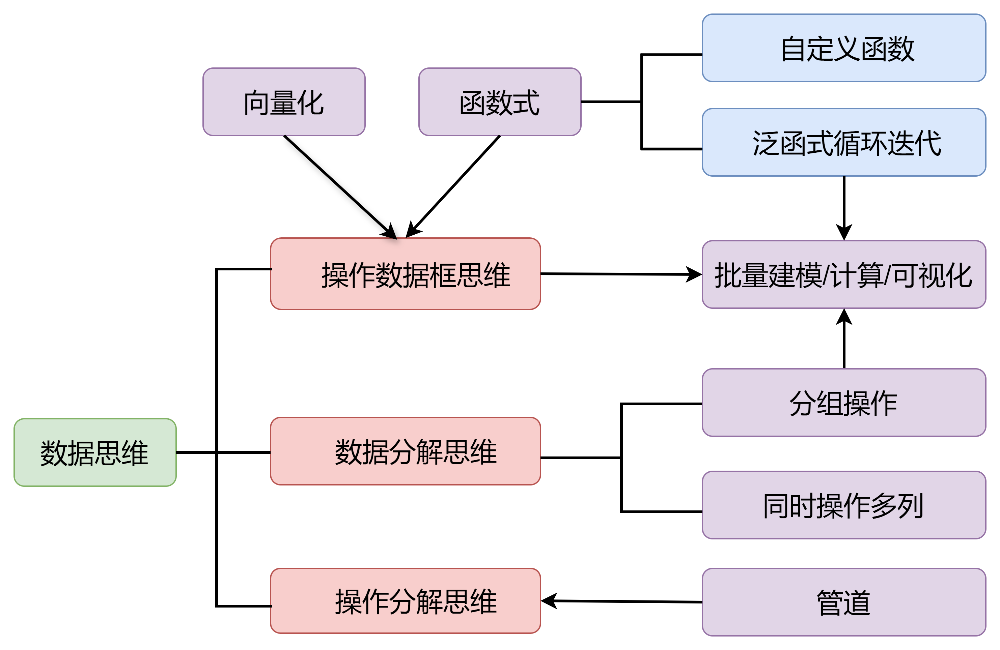

<sub>🌐 <b>中文</b> · <a href="README.en.md">English</a></sub>

<div align="center">

# tidy-data · 数据思维

> *「多数数据问题都可以用同一套数据思维解决：重塑整洁 → 分解操作 → 管道串联。」*

[](SKILL.md)
[](https://www.tidyverse.org/)
[](LICENSE)
[](https://skills.sh/zhjx19/tidy-data)

**不是又一个 tidyverse 函数参考，而是一个"问题 → 范式"定位器：拿到任何表格数据问题，30 秒定位到该用哪个范式想、该抄哪段代码。**

[看效果](#效果示例) · [安装](#快速开始) · [触发方式](#触发方式) · [它和同类有什么不同](#它和同类有什么不同) · [验证](#验证与测试)

</div>

---

## 它解决什么问题

会用 dplyr 的函数，不等于会解数据问题。真正的卡点从来不是"pivot_longer 怎么拼"，而是**面对一张表不知道第一步该干什么**：该先转长还是先分组？该用 `.by` 还是 nest+map？这个 for 循环能不能向量化？

这个 skill 的总指导思想是一张思维导图——**数据思维 2.0**：



它把数据思维收拢为三条：**操作数据框思维**（把向量化和函数式纳入数据框：向量化=操作一列/多列/分组的多列，函数式=写好函数依次应用到多列）、**数据分解思维**（分组操作、同时操作多列——函数帮你"分解+分别操作+合并结果"，你只写"分别操作"）、**操作分解思维**（复杂操作分解为基本操作，用管道依次串联）。三者汇聚于**批量建模/计算/可视化**：能完成对"一份"数据的操作，对"一批"数据的操作便水到渠成（范式 5：nest + map）。

落成可执行的结构就是：**五步法**（形状预判 → 整洁 → 分解 → 批量化 → 管道验证）+ **8 个实战范式**（每类问题信号对应一个范式）+ **破除外来思维**（Python 列表式、for 循环式、集合式习惯的纠正清单）。想清楚之后，第 6 节速查直接给你最短可复制代码。

## 效果示例

```text
你：我有一张宽表，month_1 到 month_12 每月一列，想算每个月的平均销量，输出长表。

Agent：（套用五步法）①形状预判：12 行长表 → ②列名含信息 → 范式 1 先宽变长
      → ③④ summarise(.by = month) → ⑤管道串联：

      df |>
        pivot_longer(-id, names_pattern = "month_(\\d+)",
                     names_to = "m", values_to = "sales") |>
        summarise(mean_sales = mean(sales), .by = m)
```

再比如：**"我想写个 for 循环逐行算永续盘存法"** → 范式 6 `accumulate(.init=)` 三行搞定，附"为什么不许用循环"的思维纠正。全部 8 范式见 [SKILL.md 快速定位表](SKILL.md)。

## 快速开始

**前提**：本 skill 生成并运行 R 代码——本机需装 R（建议 ≥4.2，含 dplyr ≥1.1、tidyr ≥1.3、purrr、slider）。

把本目录复制进你的 Agent 技能目录（SKILL.md 形态，Claude Code / ZCode / OpenCode / Codex 通用）：

```bash
npx skills add zhjx19/tidy-data                # skills.sh 一键安装
# 或手动克隆（目录按你的 runtime 调整）：
git clone https://github.com/zhjx19/tidy-data && cp -r tidy-data ~/.claude/skills/
```

装完对 Agent 说：

```text
用数据思维帮我解这道 R 数据题：……（描述你的表格数据和目标）
```

## 触发方式

- "这题用 R tidyverse 怎么写？" / "数据思维解一下"
- "宽表转长表 / 长表转宽表" / "列名里带月份怎么处理"
- "分组算环比 / 同比 / 每组 TopN"
- "每组删掉有缺失的" / "按组批量建模"
- "这个累计递推怎么向量化" / "滚动均值"
- "我不想用 for 循环，有没有更 R 的写法"

## 它会交付什么

| 能力 | 交付物 |
|---|---|
| 问题 → 范式定位 | 快速定位表 + 决策树（SKILL.md 内） |
| 范式思维教学 | 8 范式详述：何时用 / 思维轨迹 / 案例 / 注意（references/paradigms.md） |
| 可复制代码 | 17 段最短范型速查（SKILL.md §6） |
| 思维纠正 | 反模式黑名单 12 条 + 破除外来习惯 6 问 |
| 质量保证 | 双回归：13 例（含陷阱与组合） + 3 题 prompt 实测，一键运行 |

## 它和同类有什么不同

| 维度 | 写法参考类（tidy-r-skill、tidyverse-patterns 等） | 本 skill |
|---|---|---|
| 定位 | 教"怎么写对代码" | 教"怎么想清楚问题"：问题信号 → 范式定位 |
| 组织 | 按函数/主题排列 | 按问题信号排列（8 范式 + 决策树） |
| 思维纠正 | 少见 | §8 专治 Python 式 for 循环/列表/集合思维 |
| 质量保证 | 部分有测试说明 | 13 例（含陷阱与组合）+ 3 题 prompt 双回归，任意 locale 可跑 |

## 安全边界

- **不碰绘图**：ggplot2 图形语法不在范围（另有 ggplot2 技能）。
- **不做正式建模**：nest+map 分组建模是轻量探索；正式预测建模走 `ml-mlr3`。
- **不做数据清洗**：脏数据审计/清洗走 `data-cleaning` 技能（本 skill 兜底其结构转换）。
- **版本门槛**：`.by`/`reframe` 需 dplyr ≥1.1、`nest(.by=)` 需 tidyr ≥1.3，旧版本会直接报错。

## 文件结构

```text
├── SKILL.md                    定位器：总纲 + 定位表 + 五步法 + 范式速览 + 决策树 + 速查
├── references/paradigms.md     8 范式详述（何时用/思维轨迹/案例/注意）+ 综合案例
├── scripts/verify_examples.R   13 例范式回归（任意 locale 可跑）
├── scripts/verify_prompts.R    3 题 prompt 实测回归
├── scripts/check_consistency.py 28 项声明-实物一致性对账
├── CHANGELOG.md                版本史
├── test-prompts.json           3 条行为测试题
├── assets/data-thinking-2.0.png 数据思维 2.0 总纲思维导图
└── CHANGELOG.md                版本史
```

## 验证与测试

```bash
Rscript --vanilla scripts/verify_examples.R   # === Summary: 13/13 PASS ===
Rscript --vanilla scripts/verify_prompts.R    # === Summary: 7 check(s), 0 failure(s) ===
python scripts/check_consistency.py           # 28 项声明-实物对账，全部 PASS
```

行为测试见 [test-prompts.json](test-prompts.json)：含一条"我想用 for 循环逐行算"的对抗性
prompt——合格表现是破除循环思维、改用 `accumulate` 向量化，而不是顺着写循环。

## 致谢

- 打磨方法来自鲁班工坊（验料 → 访行 → 过尺 → 慢刨）；同行对标 [tidy-r-skill](https://github.com/statzhero/tidy-r-skill)、[tidyverse-patterns](https://www.skills.sh/s/ab604/claude-code-r-skills/tidyverse-patterns)
- 姊妹技能 `data-cleaning`：先审计后清洗，本 skill 兜底其结构转换与分组计算

## License

[MIT](LICENSE)
